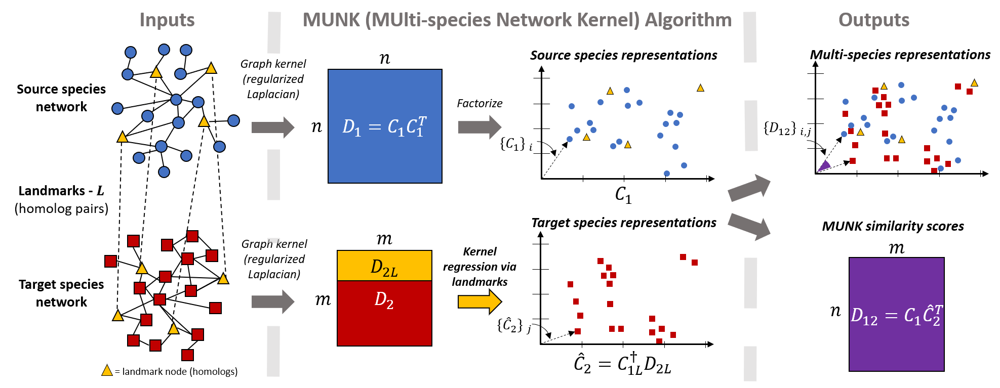

# MUlti-species Network Kernel (MUNK)

## MUNK

MUNK is an algorithm for embedding protein from a target network (e.g. mouse) into a source network (e.g. from human), thus creating unified, cross-species protein representations. The MUNK algorithm was developed by Mark Crovella (Boston University), Benjamin Hescott (Northeastern University), and Max Leiserson (University of Maryland, College Park), and their respective research groups.

## Setup

#### Install MUNK and other dependencies required to run experiments using Conda

We recommend users to install MUNK, along with other dependencies, into a Python environment using [Conda](https://conda.io/miniconda.html). To install Python and other dependencies, which you can do directly using the provided `environment.yml file`:

    conda env create -f environment.yml
    source activate munk

This `munk` Conda environment can be used to run any number of experiments and examples included in this project/repository. We note that experiments and data download for other parts of this project are implemented and configured with [Snakemake](http://snakemake.readthedocs.io/en/stable/) which will be installed as part of the `munk` environment.

#### Install MUNK using PIP as a standalone python package
Alternatively, if you would like to install `munk` as a standalone python package, you can install and build `munk` using `pip` with the provided install script. Simply execute:

    ./install_munk.sh

## Data

Once you have the dependencies installed, you can download our default datasets with the following command:

    snakemake -s data/Snakefile -d data --configfile data/data.yml

This data is used for experiments implemented in `experiments/` and described in Section 2 of [1]. Please see `data/README.md` or Sections 4.4 or S2 of [1] for more details.

## Provided scripts

#### Computing MUNK embeddings with: compute_embeddings.py
We provide a script, `compute_embeddings.py`, in the `scripts/` directory to allow users to easily compute MUNK representations and MUNK similarity scores for nodes in and across PPI networks.

`compute_embeddings.py` takes the following arguments:

* `-se`, `--source_edgelist`: path to source species PPI edgelist
* `-te`, `--target_edgelist`: path to target species PPI edgelist
* `-hf`, `--homolog_list`: path to list of homologs (a two column, tab separated list of homolog genes found in respective PPIs, with source genes in the first column and target genes in the second column)
*  `n`, `--n_landmarks`: number of landmarks to use for MUNK embeddings
* `-so`, `--source_output-file`: path to save source species MUNK embeddings
* `-to`, `--target_output-file`: path to save target species MUNK embeddings
* `-sim`, `--sim_scores_output_file`: path to save MUNK similarity scores
* `-lo`, `--landmarks_output_file`: path to save list of landmarks used for MUNK embeddings
* `-r`, `--runtimes-file`:  path to save runtime statistics for MUNK
* `--src_lam`: value of $\lambda$ to use for source species regularized Laplacian (optional, defaults to 0.05)
* `--tgt_lam`, value of $\lambda$ to use for target species regularized Laplacian (optional, defaults to 0.05)

`compute_embeddings.py` will save computed MUNK embeddings, MUNK similarity scores, as well as other diagnostic information to specified file paths. Please see `experiments/MUNK-embeddings-and-scores/` for  a simple example that uses of `compute_embeddings.py` (with Snakemake).

## Jupyter Notebooks

We also provide a Jupyter notebook, in the `notebooks/` directory to illustrate key concepts of the MUNK algorithm:

* `MUNK-Demo.ipynb` is a notebook that illustrates the key concepts of MUNK and demonstrates how MUNK is implemented

## Experiments

For the purpose of reproducibility,  we include source code for experiments described in [1] in the `experiments/` directory. Please refer to the README.md found in each experiments directory for more details.

A summary of what can be found in each directory is as as follows (we again note that each experiment is configured with Snakemake):
* `embeddings-and-scores` - An example usage and configuration of `scripts/compute_embeddings.py` using Snakemake
* `sl-mapping-using-homologs-only` - Synthetic lethal interaction prediction baseline using homologs. (See section 2.5 in [1] for more details)
* `resnik-and-dissim-plots` - Scripts to generate Figures 2a and 2b as well as figures in Section S5 in the Supplemental Infromation in [1]. (See section 2.3 in [1] for more details)
* `homology-scores-permutation-test` - Scripts to run the permutation test described in Section 2.3 in [1]. This experiment shows that MUNK captures shared biological (and topological) information in PPI networks beyond just node degree.
* `sl-prediction` -Scripts to train classifiers to predict synthetic lethal interactions across species. (See section 2.5 in [1] for more details)

## Acknowledgements

This work was supported in part by NSF grants IIS-1421759 and CNS-1618207 (to M.C.) and by a grant from the Boston University Undergraduate Research Opportunities Program (to T.L.). We thank Simon Kasif, Evimaria Terzi, Prakash Ishwar, Lenore Cowen, Donna Slonim, and the Tufts BCB group for helpful discussion on this work.

We would also like to acknowledge the following open source projects/tools:

 - [Snakemake](http://snakemake.readthedocs.io/en/stable/)
 - [Travis CI](https://travis-ci.org/)
 - [Scikit-Learn](http://scikit-learn.org/stable/)
 - [Scipy.org](https://www.scipy.org/)

that allow us to produce reproducible and clean experiments and implementations.

## References

[1] Jason Fan, Anthony Cannistra, Inbar Fried, Tim Lim, Thomas Schaffner, Mark Crovella, Benjamin Hescott*, Mark DM Leiserson*. "A Multi-Species Functional Embedding Integrating Sequence and Network Structure." _RECOMB 2018_ (to appear) [[bioRxiv]](https://www.biorxiv.org/content/early/2018/03/30/229211) * equal contribution
