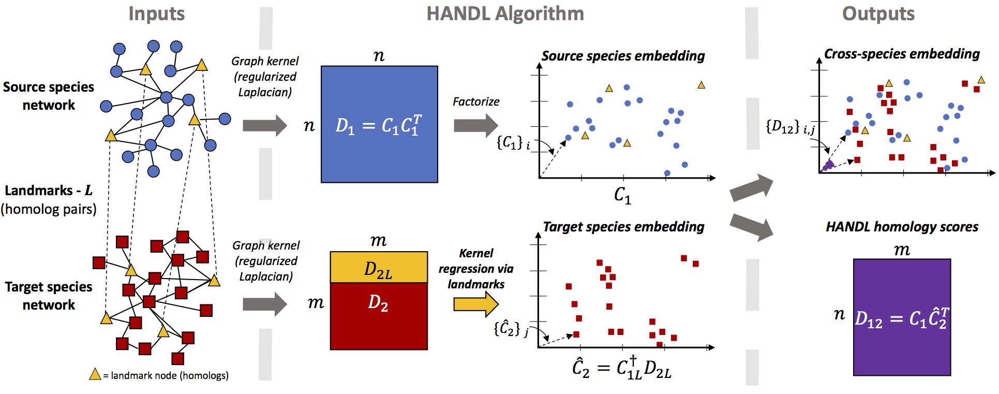

# Homology Assessment across Networks using Diffusion and Landmarks (HANDL)

## HANDL
HANDL is an algorithm for embedding proteins in a target network (e.g. mouse) into a source network (e.g. from human). The HANDL algorithm was developed by Mark Crovella (Boston University), Benjamin Hescott (Northeastern University), and Max Leiserson (University of Maryland, College Park), and their respective research groups.

-----

## Setup

#### Install HANDL and other dependencies required to run experiments using Conda

This is our recommended way to install HANDL. We recommend using [Conda
](https://conda.io/miniconda.html) to install Python and other dependencies, which you can do directly using the provided `environment.yml file`:

    conda env create -f environment.yml
    source activate HANDL

#### Install HANDL using PIP as a standalone python package
Alternatively, you can install and build HANDL using PIP with the provided install script. Simply execute:

    ./install_handl.sh

-----

## Data

Once you have the dependencies installed, you can download our default datasets with the following command:

    snakemake -s data/Snakefile -d data --configfile data/data.yml

This data is used for experiments implemented in `experiments/` and described in Section 2 of [1]. Please see `data/README.md`, Section 4.4 or Section S2 of the Supplemental Information of [1] for more details.

-----

## Provided scripts

#### Computing HANDL embeddings with: compute_embeddings.py
We provide a script, `compute_embeddings.py`, in the `scripts/` directory that computes HANDL embeddings of nodes in PPI networks.

*Arguments*:

* `-se`, `--source_edgelist`: path to source species PPI edgelist
* `-te`, `--target_edgelist`: path to target species PPI edgelist 
* `-hf`, `--homolog_list`: path to list of homologs (a two column, tab separated list of homolog genes found in respective PPIs, with source genes in the first column and target genes in the second column)
*  `n`, `--n_landmarks`: number of landmarks to use for HANDL embeddings
* `-so`, `--source_output-file`: path to save source species HANDL embeddings
* `-to`, `--target_output-file`: path to save target species HANDL embeddings
* `-sim`, `--sim_scores_output_file`: path to save HANDL homology scores
* `-lo`, `--landmarks_output_file`: path to save list of landmarks used for HANDL embeddings
* `-r`, `--runtimes-file`:  path to save runtime statistics for HANDL
* `--src_lam`: value of $\lambda$ to use for source species regularized Laplacian (optional, defaults to 0.05)
* `--tgt_lam`, value of $\lambda$ Lambda to use for source species regularized Laplacian (optional, defaults to 0.05)

*Example usage*:

Please see `experiments/HANDL-embeddings-and-scores/` for  a simple example usage of `compute_embeddings.py` (with Snakemake).

-----

## Jupyter Notebooks

We also provide Jupyter notebooks, in the `notebooks/` directory to illustrate key concepts of the HANDL algorithm:

* `HANDL-Demo.ipynb` - A notebook that illustrates the key concepts of HANDL and how HANDL is implemented
* `Permutation-test.ipynb` - A notebook that shows how permutation tests can be performed to show that HANDL captures functional similarities, across species. from topological features and not only node degrees. (See section 2.3 in [1] for more details)

----

## Experiments

For the purpose of reproducibility,  we include source code for experiments described in [1] in the `experiments/` directory. Please refer to the README.md found in each experiments directory for more details. 

A summary of what can be found in each directory is as as follows, note that each experiment is configured with Snakemake:
* `HANDL-embeddings-and-scores` - An example usage and configuration of `scripts/compute_embeddings.py` using Snakemake
* `homolog-baseline` - Synthetic lethal interaction prediction baseline using homologs. (See section 2.5 in [1] for more details)
* `resnik-and-dissim-plots` - Scripts to generate Figures 2a and 2b as well as figures in Section S5 in the Supplemental Infromation in [1]. (See section 2.3 in [1] for more details)
* `permutation-test` - Scripts to run the permutation test described in Section 2.3 in [1]
* `sl-prediction` -Scripts to train classifiers to predict synthetic lethal interactions across species. (See section 2.5 in [1] for more details)

-----

## Reference

[1] Jason Fan, Anthony Cannistra, Inbar Fried, Tim Lim, Thomas Schaffner, Mark Crovella, Benjamin Hescott*, Mark DM Leiserson*. "A Multi-Species Functional Embedding Integrating Sequence and Network Structure." _RECOMB 2018_ (to appear) [[bioRxiv]](https://www.biorxiv.org/content/early/2018/03/30/229211) * equal contribution
